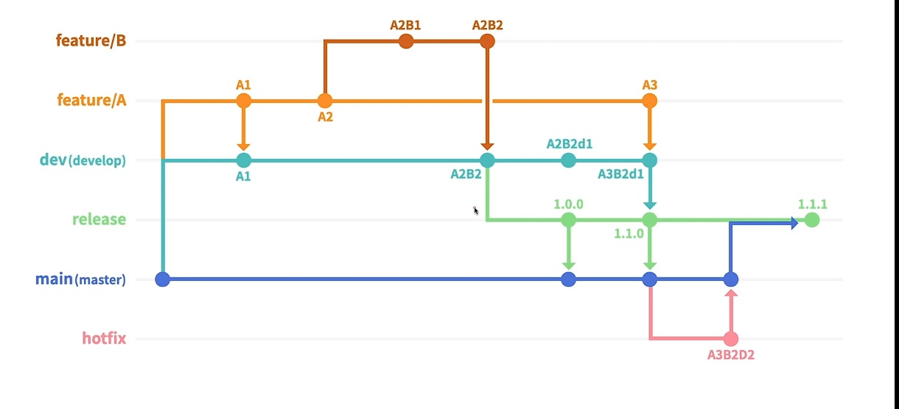

# Git 브랜치 전략 (Flow)

- 2023-10-02

## 목차

1. [Git 기본 브랜치 전략](#git-기본-브랜치-전략-git-flow)
2. [Git Flow 도식표](#git-flow)
3. [배포를 위한 Branch]

---

### Git 기본 브랜치 전략 (Git Flow)

- main (master) : 기본 /메인/ 제품 브랜치
- dev (develop) : 다음 제품 출시를 위해 여러기능을 병합하는 브랜치
- feature/\* : 각 기능 개발을 위한 브랜치
- release : 이번 제품 출시직전 최종 테스트(QA) 를 위한 브랜치
- hotfix : 제품에 버그가 확인되었을 때, 긴급 수정을 위한 브랜치

### Git Flow

### 배포를 위한 branch

- release
- main (master)
- hotfix
